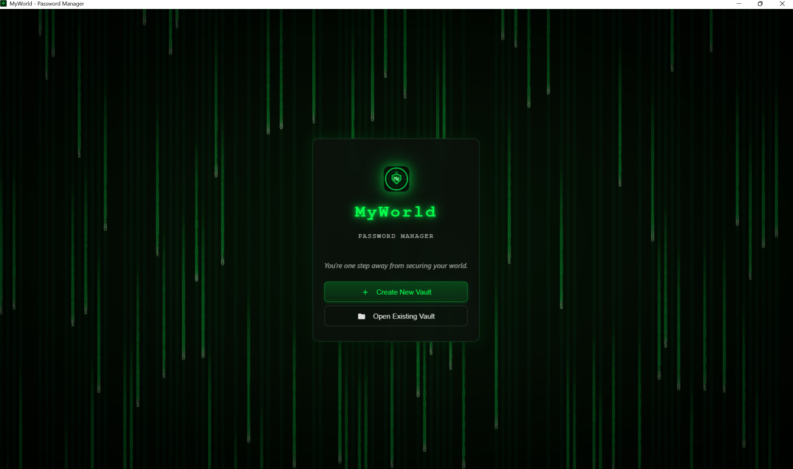
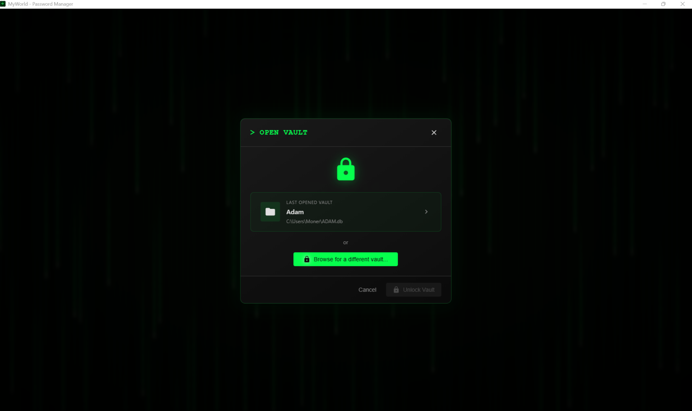
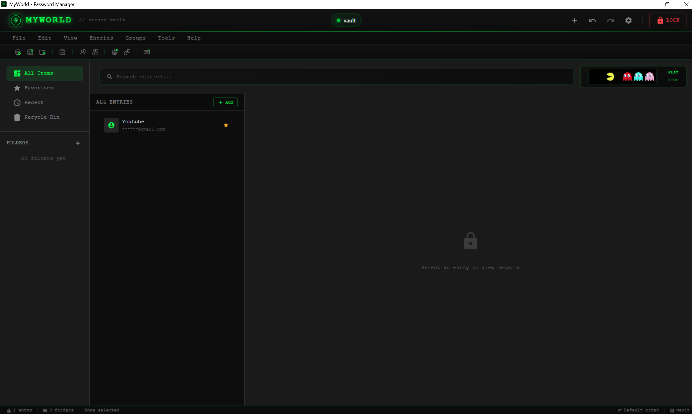
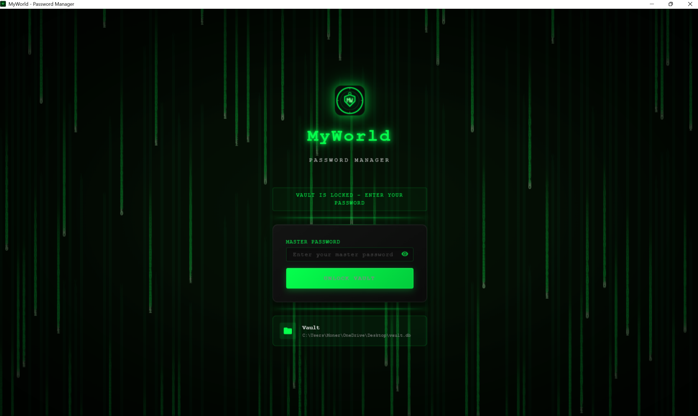

  

<h1 align="center">MyWorld</h1>

  <strong>Secure, Fast & Offline Password Management for Windows</strong>

  
  
  
  

  <a href="#-features">Features</a> •
  <a href="#-screenshots">Screenshots</a> •
  <a href="#-download">Download</a> •
  <a href="#-installation">Installation</a> •
  <a href="#-usage">Usage</a> •
  <a href="#-security">Security</a>

---

## Why MyWorld?

Still using the same password everywhere? Storing passwords in a text file? Forgetting credentials constantly?

**MyWorld** is a secure, offline password vault that keeps all your credentials encrypted and organized. No cloud, no subscriptions, no data collection — your passwords stay on your device, protected by military-grade encryption.

---

## ✨ Features

<table>
<tr>
<td width="50%">

### 🔐 Security First
- **AES-256 Encryption** - Military-grade protection
- **PBKDF2 Key Derivation** - Master password never stored
- **Auto-Lock** - Locks after inactivity
- **Memory Protection** - Clears sensitive data from RAM

</td>
<td width="50%">

### 📁 Organization
- **Categories** - Group by type (Social, Banking, Work)
- **Custom Tags** - Flexible labeling system
- **Smart Search** - Find entries instantly
- **Favorites** - Quick access to frequent items

</td>
</tr>
<tr>
<td width="50%">

### 🔑 Password Tools
- **Password Generator** - Create strong passwords
- **Strength Meter** - Visual security indicator
- **Duplicate Detection** - Find reused passwords
- **Breach Check** - Verify against known leaks

</td>
<td width="50%">

### 💾 Data Management
- **Encrypted Backup** - Secure your vault
- **Import/Export** - Migrate from other apps
- **Clipboard Auto-Clear** - Removes copied data
- **100% Offline** - No internet required

</td>
</tr>
</table>

---

## 📸 Screenshots

  

<b>View More Screenshots</b>

 

  

  

  

---

## 📥 Download

### Latest Release: v2.0.0

| Type | Download | Description |
|------|----------|-------------|
| **Installer** | [MyWorld_Setup_2.0.0.exe](https://github.com/moneraldabai-ui/MyWorld/releases/download/v2.0.0/MyWorld_Setup_2.0.0.exe) | Recommended - Full installation |

> **Requirements:** Windows 10/11 (64-bit) • 4 GB RAM • 100 MB disk space

---

## 🚀 Installation

### Option 1: Installer (Recommended)
1. Download the [latest installer](https://github.com/moneraldabai-ui/MyWorld/releases/latest)
2. Run `MyWorld_Setup_2.0.0.exe`
3. Follow the installation wizard
4. Launch from desktop or Start menu

---

## 📖 Usage

### Getting Started
1. **Launch** the application
2. **Create** a strong master password (this is the only password you'll need to remember)
3. **Start adding** your credentials

### Adding Entries
- Click **+ Add** or press `Ctrl+N`
- Fill in: Title, Username, Password, URL, Notes
- Use the **Generate** button for strong passwords
- Select a category and save

### Password Generator
| Option | Description |
|--------|-------------|
| Length | 8-128 characters |
| Uppercase | A-Z |
| Lowercase | a-z |
| Numbers | 0-9 |
| Symbols | !@#$%^&* |

### Keyboard Shortcuts
| Shortcut | Action |
|----------|--------|
| `Ctrl+N` | New entry |
| `Ctrl+F` | Search |
| `Ctrl+L` | Lock vault |
| `Ctrl+B` | Copy password |
| `Ctrl+U` | Copy username |

---

## 🔒 Security

Your security is our priority.

| Feature | Description |
|---------|-------------|
| **Encryption** | AES-256-GCM authenticated encryption |
| **Key Derivation** | PBKDF2 with 100,000+ iterations |
| **Zero Knowledge** | Master password never stored or transmitted |
| **Local Storage** | All data stays on your device |
| **No Telemetry** | No tracking, no analytics, no data collection |

For security issues, see [SECURITY.md](SECURITY.md).

---

## 📜 License

This project is licensed under the **MIT License** - see the [LICENSE](LICENSE) file for details.

---

## 👤 Author

**M. O. N. E. R**

- GitHub: [@moneraldabai-ui](https://github.com/moneraldabai-ui)
- Email: moner.aldabai@gmail.com

---

## ⭐ Support

If you find MyWorld useful, please consider:

- **Starring** this repository ⭐
- **Sharing** with friends and colleagues
- **Reporting** bugs or suggesting features

---

  Made with ❤️ for privacy-conscious users

  <a href="https://github.com/moneraldabai-ui/MyWorld/issues">Report Bug</a> •
  <a href="https://github.com/moneraldabai-ui/MyWorld/issues">Request Feature</a>

